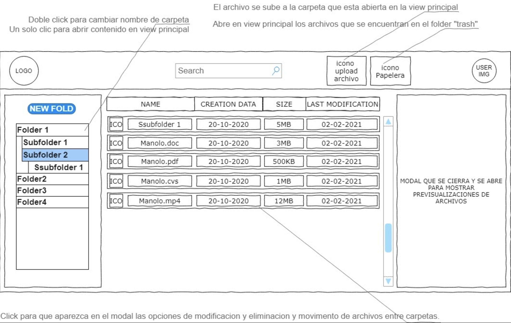
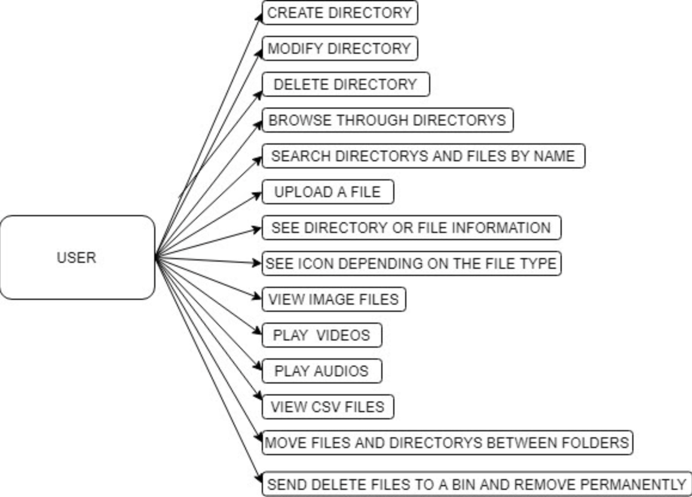

[![Contributors][contributors-shield]][contributors-url]
[![Forks][forks-shield]][forks-url]
[![Stargazers][stars-shield]][stars-url]
[![Issues][issues-shield]][issues-url]
[![MIT License][license-shield]][license-url]

 

  

  <h3 align="center"> Local FileSystem Explorer - MVP </h3>

  

    Owner(s) - @RaulCatedra3003  
    Collaborators - @RaulCatedra3003  
    Status - To Approve
     
    <a href="https://github.com/RaulCatedra3003/Local-FileSystem-explorer"><strong>Explore the docs »</strong></a>
     
     
    <a href="https://github.com/RaulCatedra3003/Local-FileSystem-explorer">View Demo</a>
    ·
    <a href="https://github.com/RaulCatedra3003/Local-FileSystem-explorer/issues">Report Bug</a>
    ·
    <a href="https://github.com/RaulCatedra3003/Local-FileSystem-explorer/issues">Request Feature</a>
  

## 🔮 Overview 🔮
The aim of this project is to create a system file explorer that allows the user to navigate, create and upload files in the same way as in his usual operating system. 

  

## ⚓ MVP general requirements ⚓
- No PHP global variables.
- GIT must be used.
- PHP version 7.0 or above.
- Well defined and clear file architecture.
- All the code and comments must be in english. 
- No inline styles on HTML
- No multiple languages on the same file rule.
- Split the workload properly into small tasks.
- Remove all the unnecessary code and comments.

  

## ⚙️ MVP specific requirements ⚙️
- Take into account from which path the user starts and which path they access.
- CRUD functionality to manage folders.
- Be able to through folders but not above root level.
- Folders and files search. In case of files we want to search also by file extension.
- Upload from local a file to a folder in the app.
- File and folder information:
    - Creation Date
    - Last modification
    - File extension
    - Size in MB ( KB in case of be less than 1 MB)

- Show different icons by file extension (doc, csv, jpg, png, txt, ppt, odt, pdf, zip, rar, exe, svg, mp3, mp4).
- Be able to preview images, audios and videos.

  

## 💣 Extra specific requirements 💣
- Preview of CSV files.
- Move folders and files from folder.
- Deleted content should go to a trash folder and only removed from the app once this folder is emptied.

  

## 🧬 Project Structure 🧬

  

## ✏️ Tasks and Organization ✏️

[GitHub Kanban](https://github.com/RaulCatedra3003/Local-FileSystem-explorer/projects/1) made with 💚

  

### Wireframe

On the above image we mocked up the UX and interface of the app.

  

### Use cases

On this diagram you will have a clear view of all the actions the user could take and the app will have to cover.

  

## 🤖 Proposed Technologies 🤖

- [PHP](https://www.php.net/docs.php) as main backend and frontend language.
- [Netlify](https://www.netlify.com/) as a hosting solution (Extra)

  

## 💨 Issues 💨

  

## 👩‍🏫 Lessons 🧑‍🏫

  

## 📚 Resources 📚

[File system](https://es.wikipedia.org/wiki/Administrador_de_archivos)   
[PHP FileSystem W3C](https://www.w3schools.com/php/php_ref_filesystem.asp)   
[PHP FileSystem Oficial](https://www.php.net/manual/es/book.filesystem.php)   
[README Guidelines Example](https://gist.github.com/PurpleBooth/109311bb0361f32d87a2)   
[PHP File System Beginner](https://www.youtube.com/watch?v=gjev53a3PDw&list=PLyKBLKYqadGkqb70sP212RBP5Pqao7vgq)   
[Mostrar archivos de una carpeta con PHPMOSTRAR ARCHIVOS DE UNA CARPETA CON PHP](https://programandoointentandolo.com/2013/09/mostrar-archivos-de-una-carpeta-con-php.html#:~:text=Para%20poder%20mostrar%20el%20contenido,se%20puede%20usar%20como%20iterador)   
[PHP: sistema de ficheros](https://www.youtube.com/watch?v=kGcc5VjkgMs&ab_channel=iDESWEBUA)   
[PHP: sistema de ficheros (ejemplo)](https://www.youtube.com/watch?v=H6ee9m5Y9P0)   

## 🎉 Accomplishments 🎉

Icons made by <a href="https://www.flaticon.com/authors/dimitry-miroliubov" title="Dimitry Miroliubov">Dimitry Miroliubov</a> from <a href="https://www.flaticon.com/" title="Flaticon">www.flaticon.com</a>

  

<!-- MARKDOWN LINKS & IMAGES -->
<!-- https://www.markdownguide.org/basic-syntax/#reference-style-links -->
[contributors-shield]: https://img.shields.io/github/contributors/RaulCatedra3003/Local-FileSystem-explorer.svg?style=flat-square
[contributors-url]: https://github.com/RaulCatedra3003/Local-FileSystem-explorer/graphs/contributors
[forks-shield]: https://img.shields.io/github/forks/RaulCatedra3003/Local-FileSystem-explorer.svg?style=flat-square
[forks-url]: https://github.com/RaulCatedra3003/Local-FileSystem-explorer/network/members
[stars-shield]: https://img.shields.io/github/stars/RaulCatedra3003/Local-FileSystem-explorer.svg?style=flat-square
[stars-url]: https://github.com/RaulCatedra3003/Local-FileSystem-explorer/stargazers
[issues-shield]: https://img.shields.io/github/issues/RaulCatedra3003/Local-FileSystem-explorer.svg?style=flat-square
[issues-url]: https://github.com/RaulCatedra3003/Local-FileSystem-explorer/issues
[license-shield]: https://img.shields.io/github/license/RaulCatedra3003/Local-FileSystem-explorer.svg?style=flat-square
[license-url]: https://github.com/RaulCatedra3003/Local-FileSystem-explorer/blob/master/LICENSE.txt
[linkedin-shield]: https://img.shields.io/badge/-LinkedIn-black.svg?style=flat-square&logo=linkedin&colorB=555
